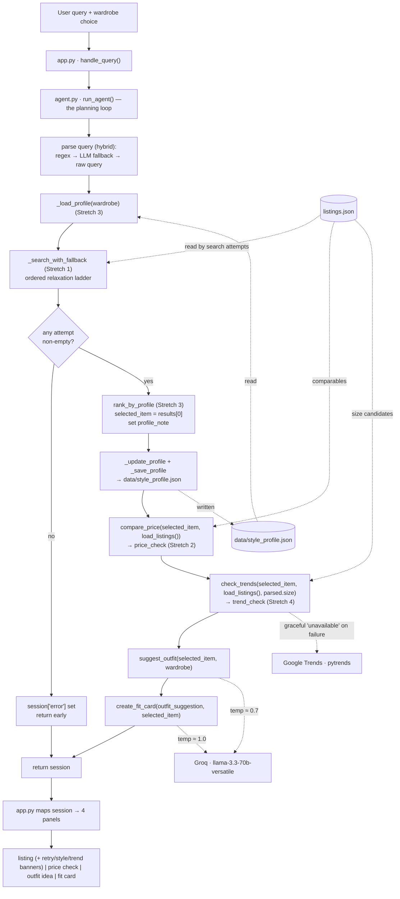

# FitFindr 🛍️

A multi-tool AI agent that helps you find secondhand clothing, check whether the
price is fair, see if the style is trending, style it against your wardrobe, and
turn the result into a shareable "fit card" caption — all from one natural-language
query.

Built for CodePath AI201, Project 2. Six tools, a conditional planning loop, a
single session dict for state, and a Gradio UI.

---

## Setup

```bash
pip install -r requirements.txt
```

The two generative tools (`suggest_outfit`, `create_fit_card`) and the
trend-awareness tool call external APIs:

- **Groq** (`llama-3.3-70b-versatile`) — set `GROQ_API_KEY` in your shell
  environment (a `.env` file also works via `python-dotenv`, but isn't required
  if the key is already exported).
- **Google Trends** via `pytrends` — no account or API key needed. Note:
  `pytrends` is an unofficial, archived library that occasionally returns
  `429 Too Many Requests`; `check_trends` handles this gracefully (see
  Error Handling below).

## Running the app

```bash
python app.py
```

Open the printed localhost URL (usually `http://localhost:7860`). Type a query
(e.g. *"vintage graphic tee under $30, size M"*), pick a wardrobe (example or
empty), and hit **Find it**. A few example queries — including a deliberate
no-results case — are pre-loaded under the search box.

To run the tests:

```bash
pytest
```

---

## Tool inventory

All six tools live in `tools.py`. Each is independently tested in
`tests/test_tools.py`.

### Tool 1 — `search_listings`

```python
search_listings(description: str, size: str | None = None, max_price: float | None = None) -> list[dict]
```

Searches the 40-item mock dataset (`load_listings()`). Filters by `max_price`
(inclusive) and by `size` using **token matching** — `"M"` matches a listing
sized `"S/M"` or `"M/L"` but not `"XL"`. Scores survivors by counting how many
keywords from `description` (minus a small stop-word list) appear in the
listing's title/description/style_tags/category/colors/brand, drops
zero-score listings, and sorts by score desc, then price asc. This is the
**only** tool that reads `listings.json` — every other tool receives data as
arguments.

**Returns:** `list[dict]` of full listing dicts (best match first), or `[]`
if nothing matches.

### Tool 2 — `suggest_outfit`

```python
suggest_outfit(new_item: dict, wardrobe: dict) -> str
```

Calls the Groq LLM (temperature ≈ 0.7) to suggest 1–2 outfits pairing
`new_item` with pieces from `wardrobe["items"]`. If the wardrobe is empty
(`wardrobe["items"] == []`), it instead returns general styling advice
(silhouettes, colors, vibe) — never an empty string.

**Returns:** a non-empty `str`.

### Tool 3 — `create_fit_card`

```python
create_fit_card(outfit: str, new_item: dict) -> str
```

Calls the Groq LLM at a higher temperature (≈ 1.0) to turn an outfit
suggestion into a short, casual, shareable caption mentioning the item's
title, price, and platform. Varies across calls on the same input.

**Returns:** a 2–4 sentence `str`, or a descriptive error string if `outfit`
is empty/whitespace (see Error Handling).

### Tool 4 — `compare_price` (Stretch 2)

```python
compare_price(new_item: dict, comparables: list[dict]) -> dict
```

Pure and deterministic — no LLM, no filesystem. Self-selects same-`category`
peers from `comparables` (excluding `new_item` by `id`), computes the median
price and `new_item`'s percentile among peers, and bands the result:
`percentile <= 25 → "great_deal"`, `> 75 → "high"`, else `"fair"`. Fewer than
3 peers → `"insufficient_data"`.

**Returns:** `{band, verdict, price, median, n_comparables, category}`.
`run_agent` calls it as `compare_price(selected_item, load_listings())`.

### Tool 5 — `rank_by_profile` (Stretch 3)

```python
rank_by_profile(listings: list[dict], profile: dict) -> list[dict]
```

Pure and deterministic — no LLM, no filesystem. Re-orders an already
relevance-sorted `listings` list by blending search-rank position (60%) with
the user's learned **style profile** affinity (40%, min-max normalized),
stable-sorted descending. A cold/empty `profile` makes every affinity 0, so
the result is the unchanged search order.

**Returns:** the same listings, reordered. The agent owns persistence:
`_load_profile` / `_update_profile` / `_save_profile` in `agent.py` read and
write `data/style_profile.json` (path behind `PROFILE_PATH` for tests).

### Tool 6 — `check_trends` (Stretch 4)

```python
check_trends(new_item: dict, listings: list[dict], size: str | None = None) -> dict
```

Hybrid dataset + live API. Token-matches `listings` against `size` to build a
"size bucket" (`size=None` → all listings); fewer than 3 → `"insufficient_data"`.
From that bucket it builds up to 5 candidate style tags (`new_item`'s own tags
first, then the bucket's most common tags), then makes **one Google Trends
call** (via `pytrends`, behind the `_fetch_trend_ranking` seam) to rank those
candidates by live search momentum. The top 3 become `trending`; if any of
`new_item`'s tags are in `trending`, `band="on_trend"`, else `"off_trend"`. A
failed/rate-limited Trends call degrades to `band="unavailable"` — never
raises.

**Returns:** `{band, verdict, trending, item_tags_on_trend, size, source}`.

---

## Planning loop

`run_agent(query, wardrobe) -> dict` in `agent.py` is a single loop with one
real branch — on whether `search_listings` (via the retry ladder) finds
anything:

1. **Parse the query** (hybrid): regex pulls `size` (incl. word sizes like
   "Medium" → "M") and `max_price` (incl. "$30", "30 dollars", "under $30");
   leftover words become `description`. If `description` comes out empty, an
   LLM fallback parses the raw query; if that also fails, the raw query string
   is used as `description`. This guarantees `search_listings` always gets a
   usable `description`.
2. **Load the style profile** (Stretch 3) — `_load_profile(wardrobe)` reads
   `data/style_profile.json`, seeding from the wardrobe on a missing/corrupt
   file.
3. **Search with fallback** (Stretch 1) — `_search_with_fallback(description,
   size, max_price)` runs an ordered relaxation ladder: exact search → drop
   `size` → drop `size` and `max_price`. The first non-empty result set wins;
   `description` is never dropped. A `retry_note` records which filter(s) were
   loosened (or `None` on an exact match).
4. **Branch:**
   - **Empty after every applicable attempt** → set `session["error"]` to a
     specific message (admitting the loosening was tried) and **return early**.
     `selected_item`, `outfit_suggestion`, `fit_card`, `retry_note`, and
     `profile_note` stay `None`; `suggest_outfit` is never called on empty
     input.
   - **Non-empty** → `rank_by_profile(results, style_profile)` re-ranks by
     taste; `selected_item = results[0]`; build a `profile_note` banner from
     the pre-update profile's top tastes (`None` if the profile is cold).
5. **Learn + persist** (Stretch 3) — fold `selected_item` into the profile and
   save it to `data/style_profile.json`.
6. **Price check** (Stretch 2) — `compare_price(selected_item,
   load_listings())`, unconditional, non-branching.
7. **Trend check** (Stretch 4) — `check_trends(selected_item, load_listings(),
   parsed["size"])`, unconditional, non-branching. Scoped to the user's
   originally **requested** size, even if the retry ladder dropped it.
8. **Suggest outfit** — `suggest_outfit(selected_item, wardrobe)`.
9. **Fit card** — `create_fit_card(outfit_suggestion, selected_item)`.
10. **Return** the finished session dict.

The conditional branch in step 4 is what makes this a *planning loop* rather
than a fixed call-all-tools sequence — `suggest_outfit`, `create_fit_card`,
`rank_by_profile`, `compare_price`, and `check_trends` are all skipped on the
no-results path.

---

## State management

A single **session dict**, created by `_new_session(query, wardrobe)`, is the
one source of truth for the whole interaction. `run_agent` owns it: it reads
fields written by earlier steps, passes them as arguments to each (pure) tool,
and writes the return value back into a new field. The tools themselves never
read or write the session.

| Field | Written by | Consumed by |
|-------|-----------|-------------|
| `query` | `_new_session` | parse step |
| `parsed` | parse step (`{description, size, max_price}`) | `_search_with_fallback`, `check_trends` |
| `search_results` | `_search_with_fallback` → `search_listings` | branch step (`results[0]`) |
| `retry_note` | `_search_with_fallback` (Stretch 1) | `app.py` — banner above the listing |
| `style_profile` | `_load_profile`, then `_update_profile` (Stretch 3) | `rank_by_profile`, `_save_profile` |
| `profile_note` | branch step, from the pre-update profile (Stretch 3) | `app.py` — banner above the listing |
| `selected_item` | branch step (`results[0]`) | `compare_price`, `check_trends`, `suggest_outfit`, `create_fit_card` |
| `price_check` | `compare_price` (Stretch 2) | `app.py` — "Price check" panel |
| `trend_check` | `check_trends` (Stretch 4) | `app.py` — banner above the listing |
| `wardrobe` | `_new_session` | `suggest_outfit` |
| `outfit_suggestion` | `suggest_outfit` | `create_fit_card` |
| `fit_card` | `create_fit_card` | output panel |
| `error` | branch step, if search was empty | output panel (short-circuits the rest) |

`app.py`'s `handle_query()` calls `run_agent()` and maps the finished session
to four Gradio panels: **listing** (with up to three stacked banners — retry,
style, trend), **price check**, **outfit idea**, and **fit card**. If
`session["error"]` is set, that message fills the listing panel and the other
three panels stay empty.

---

## Error handling

| Tool / step | Failure mode | Behavior | Real example |
|---|---|---|---|
| `search_listings` | No listings match | Returns `[]` (never raises) | `search_listings("designer ballgown", size="XXS", max_price=5)` → `[]` |
| Retry ladder (Stretch 1) | Initial search empty | Relaxes size → then size+price and retries before erroring; surfaces `retry_note` if recovered | `"vintage tee, size S, under $15"` with no size-S match → drops size, finds an M tee, sets `retry_note = "↔ No exact match — I loosened the size filter to find this. Closest piece: size M, $25."` |
| Planning loop | Every ladder attempt empty | Sets `session["error"]`, returns early — `suggest_outfit`/`create_fit_card`/`rank_by_profile`/`check_trends` are never called | `"designer ballgown, size XXS, under $5"` → `session["error"] = "I couldn't find any listings matching 'designer ballgown' in size XXS under $5 — even after dropping the size and price filters. Try broader search terms (e.g. 'dress')."` |
| `suggest_outfit` | Empty wardrobe | Returns general styling advice (silhouettes/colors/vibe) instead of named pieces — never empty, never crashes | `suggest_outfit(item, get_empty_wardrobe())` → a general-advice paragraph with no wardrobe item ids |
| `create_fit_card` | Empty/whitespace `outfit` | Returns a descriptive error string instead of raising | `create_fit_card("", item)` → `"⚠️ No outfit to write up yet — run a search that finds an item first."` |
| `compare_price` (Stretch 2) | Fewer than 3 same-category peers | Returns `band="insufficient_data"`, `median=None`, never raises | Any **accessories** item (only 2 peers in the dataset) → `"💰 Not enough comparable accessories listings to judge this price (only 2 found)."` |
| `rank_by_profile` (Stretch 3) | Cold/empty profile, or missing/corrupt `style_profile.json` | Affinities are all 0 → listings returned unchanged (no-op); `_load_profile` catches a missing/corrupt file and returns an empty or wardrobe-seeded profile | First-ever run with no `data/style_profile.json` → results stay in search-relevance order, `profile_note = None` |
| `check_trends` (Stretch 4) | Google Trends call fails / 429s | Returns `band="unavailable"`, `trending=[]`, never raises (required failure-mode test mocks `_fetch_trend_ranking` to raise) | `"🌐 Couldn't reach Google Trends just now — trend check unavailable for this run."` |
| `check_trends` (Stretch 4) | Sparse size bucket (`< 3` listings) | Returns `band="insufficient_data"` before any network call | Size `"W28"` (2 listings in the dataset) → `"🔍 Not enough size W28 listings to assemble a trend read (only 2 found)."` |

All three core failure modes (`search_listings` no-match, empty-wardrobe
`suggest_outfit`, empty-outfit `create_fit_card`) were deliberately triggered
and screenshotted in `milestone5_tests.png`.

---

## Architecture



`listings.json` is read only inside `search_listings`; `run_agent` passes the
loaded data into `compare_price` and `check_trends` so they stay pure.

---

## Spec reflection

- **The brief's "public fashion platform" → live Google Trends.** The original
  brief calls for a tool that checks a "public fashion platform" for trends.
  We interpreted this as **Google Trends via `pytrends`**, since it's live,
  needs no new account, and the app already makes a live Groq call — so an
  "offline-only" framing wouldn't be consistent. The tradeoff is that
  `pytrends` is unofficial/archived and 429s under load, so `check_trends`
  treats that as an expected, gracefully-handled outcome rather than an edge
  case.
- **Retry ladder vs. immediate error.** The required behavior was "no results
  → set `session["error"]` and stop." We extended this with an ordered
  relaxation ladder (drop size, then drop size+price) that runs *before*
  giving up, because a strict size/price match often hides a near-miss the
  user would happily accept. `description` is never relaxed, and the ladder
  still terminates in the same `session["error"]` + early-return path if every
  attempt comes back empty — so the required invariant ("never call
  `suggest_outfit` on empty input") holds in both the original and extended
  designs.
- **Style-profile memory as a re-ranker, not a filter.** Rather than filtering
  out off-taste items (which could hide a strong relevance match), the style
  profile only **re-orders** the already-relevant result set via a 60/40
  relevance/affinity blend. A cold profile is mathematically a no-op, so the
  feature degrades to "exactly the original behavior" for new users instead of
  needing a separate code path.
- **Price check and trend check are additive, not gating.** Both Stretch 2 and
  Stretch 4 run unconditionally after a successful search and never influence
  which tools run next — keeping the one real branch (empty vs. non-empty
  search) the only branch in the loop, as required by the "conditional
  planning loop, not call-all-three" constraint.

---

## AI usage

This project was built collaboratively with **Claude Code** in a
draft-and-explain mode: each tool/feature was specced in `planning.md` first
(signature, inputs, logic, return, failure mode), then implemented test-first.

1. **Tool implementation from spec blocks (M3, SI1–SI4).** For each tool —
   including the four stretch tools — I gave Claude Code the exact
   `planning.md` spec block (signature, matching/computation logic, return
   shape, failure mode) and asked it to implement the function in `tools.py`
   (or the helper in `agent.py`) plus a failure-mode test in
   `tests/test_tools.py` / `tests/test_agent.py` first. For example, for
   `compare_price` I expected a pure function that self-selects same-category
   peers and bands by percentile; I verified by reading the implementation to
   confirm it excludes the item by `id` and guards `n < 3`, then ran
   `pytest tests/test_tools.py -k compare_price` to confirm the
   `insufficient_data` failure mode (any **accessories** item, 2 peers) and the
   `great_deal`/`fair`/`high` bands on `lst_002` and fixture data.
2. **Wiring the planning loop and Gradio panels (M4, SI1–SI4).** For
   `run_agent` and `handle_query`, I gave Claude Code the **Planning Loop**,
   **State Management**, and **Architecture** sections of `planning.md`
   together and asked it to wire each new tool into the session dict and the
   right Gradio panel/banner without changing the existing branch structure.
   I verified by reading the diff to confirm the branch on `search_results ==
   []` still returns early before the new steps (so `compare_price` /
   `check_trends` / `rank_by_profile` are never reached on a no-match), then
   ran the full `pytest` suite (62 tests) and a live `python app.py` smoke
   test across both the happy path and the deliberate no-results query.
3. **Isolating external calls behind seams for deterministic tests.** When
   adding `check_trends` (which makes a live `pytrends` call), I asked Claude
   Code to follow the same pattern already used for `_get_groq_client` —
   isolate the network call behind a small `_fetch_trend_ranking(terms)`
   function so tests can monkeypatch it. I verified this by confirming
   `tests/test_tools.py` mocks `_fetch_trend_ranking` to raise for the required
   `unavailable` failure-mode test, and then ran a separate one-off live smoke
   run (no mocking) to confirm the real `pytrends` path returns
   `source="google_trends"` with plausible `trending` tags.

---

## Repo layout

```
project2_fitfindr/
├── agent.py            # run_agent() — the planning loop + Stretch 1/3 helpers
├── app.py               # Gradio UI — handle_query() maps session → 4 panels
├── tools.py             # all 6 tools
├── data/
│   ├── listings.json
│   ├── wardrobe_schema.json
│   └── style_profile.json   # persistent style memory (Stretch 3), sample committed
├── utils/data_loader.py # load_listings(), get_example_wardrobe(), get_empty_wardrobe()
├── tests/                # pytest — test_tools.py, test_agent.py, test_app.py (62 tests)
├── planning.md           # full design spec (graded artifact)
├── milestone5_tests.png  # screenshot of the three required failure modes
└── demo.mp4               # 3–5 min walkthrough
```
