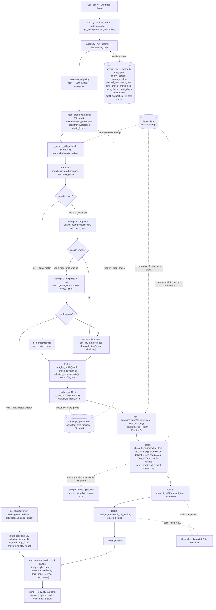

# FitFindr — planning.md

> Complete this document before writing any implementation code.
> Your spec and agent diagram are what you'll use to direct AI tools (Claude, Copilot, etc.) to generate your implementation — the more specific they are, the more useful the generated code will be.
> Your planning.md will be reviewed as part of your submission.
> Update it before starting any stretch features.

---

## Tools

List every tool your agent will use. For each tool, fill in all four fields.
You must have at least 3 tools. The three required tools are listed — add any additional tools below them.

### Tool 1: search_listings

**Exact signature:** `search_listings(description: str, size: str | None = None, max_price: float | None = None) -> list[dict]`

**What it does:**
Searches the 40-item mock listings dataset (`load_listings()`) for pieces matching a
free-text `description`, optionally narrowed by `size` and a price ceiling, and returns
the survivors ranked by keyword relevance. This is the only tool that touches the
dataset; the other tools work on whatever item it surfaces.

**Input parameters:**
- `description` (str): free-text keywords describing the wanted piece, e.g.
  `"vintage graphic tee"`. Required. Drives the relevance ranking.
- `size` (str | None): a single size token to filter by, e.g. `"M"`, `"L"`, `"8"`.
  `None` (default) skips size filtering.
- `max_price` (float | None): inclusive upper price bound in dollars, e.g. `30.0`.
  `None` (default) skips price filtering.

**Matching logic (so this is implementation-ready):**
1. `load_listings()` to get all 40 dicts.
2. **Price filter:** if `max_price` is set, keep listings with `price <= max_price`
   (inclusive).
3. **Size filter (token match):** if `size` is set, lowercase the listing's `size`,
   split it on slashes and spaces, and keep the listing only if the requested size
   equals one of those tokens. So `"M"` matches `"S/M"`, `"M/L"`, `"M (oversized)"`,
   but **not** `"XL"` or `"US 8"`.
4. **Relevance score:** lowercase `description`, remove a small stop-list of filler
   words (`a, an, the, for, in, with, looking, want, need`), split into keywords.
   Build a searchable blob per listing from `title + description + style_tags +
   category + colors + brand`. Score = the number of distinct keywords that appear
   as a substring in that blob.
5. **Drop** any listing scoring `0`, sort the rest by score (highest first),
   break ties by lower `price`.

**What it returns:**
A `list[dict]` of full listing dicts, best match first. Each dict has all 11 dataset
fields: `id, title, description, category, style_tags (list), size, condition,
price (float), colors (list), brand, platform`. The planning loop uses `results[0]`
as the selected item. Returns `[]` when nothing survives the filters/scoring.

**What happens if it fails or returns nothing:**
Returns an empty list `[]` — it **never raises**. The planning loop detects the empty
list, writes a helpful message into `session["error"]`, and stops before calling the
later tools (it never passes empty input to `suggest_outfit`).

---

### Tool 2: suggest_outfit

**Exact signature:** `suggest_outfit(new_item: dict, wardrobe: dict) -> str`

**What it does:**
Calls the Groq LLM (`llama-3.3-70b-versatile`) to style one thrifted item against the
user's wardrobe, returning one or two complete outfit combinations that name real
pieces the user already owns.

**Input parameters:**
- `new_item` (dict): a single listing dict (normally `search_results[0]`) — the item
  the user is considering. Supplies title, category, colors, style_tags to the prompt.
- `wardrobe` (dict): a wardrobe dict with an `"items"` key holding a list of
  wardrobe-item dicts (`id, name, category, colors, style_tags, notes`). May be empty
  (`{"items": []}` from `get_empty_wardrobe()`).

**What it returns:**
A non-empty `str`. With a populated wardrobe: 1–2 specific outfits that pair `new_item`
with named wardrobe pieces (e.g. "with your baggy dark-wash jeans (w_001) and chunky
white sneakers (w_007)…"). With an empty wardrobe: general styling advice for the item
(what silhouettes, colors, and vibe it pairs with) instead of named pieces.
Temperature ≈ **0.7** — coherent, lightly varied.

**What happens if it fails or returns nothing:**
- Empty wardrobe (`wardrobe["items"] == []`) is handled explicitly: return the
  general-advice string, never an empty string and never a crash.
- If the LLM/network call raises, it is caught and a short graceful fallback string is
  returned instead of propagating the exception (honors "no crash / no silent fail").

---

### Tool 3: create_fit_card

**Exact signature:** `create_fit_card(outfit: str, new_item: dict) -> str`

**What it does:**
Calls the Groq LLM at a **higher temperature** to turn an outfit suggestion into a
short, casual, shareable caption — the kind of thing you'd put under an OOTD post —
mentioning the item name, price, and platform once each.

**Input parameters:**
- `outfit` (str): the outfit-suggestion text returned by `suggest_outfit()`.
- `new_item` (dict): the same listing dict, used for the item's `title`, `price`,
  and `platform` so the caption can name them naturally.

**What it returns:**
A 2–4 sentence `str` usable as an Instagram/TikTok caption. It reads casually (not like
a product description) and **varies for different inputs** — both because the content is
item/outfit-dependent and because the temperature is high (≈ **1.0**).

**What happens if it fails or returns nothing:**
If `outfit` is empty or whitespace-only, it returns a descriptive **error string**
(e.g. *"⚠️ No outfit to write up yet — run a search that finds an item first."*) rather
than raising. On the happy path this guard is never hit, because the planning loop only
reaches this tool after a successful search produced an outfit.

---

### Additional Tools (if any)

Stretch features are specced here and each updates this document before its code is
written. **Stretch 2 adds a real 4th tool (`compare_price`)**, **Stretch 3 a 5th
(`rank_by_profile`)**, and **Stretch 4 a 6th (`check_trends`)**; Stretch 1 is a
planning-loop enhancement with no new public signature:

- **Stretch 1 — Retry logic with fallback** (planning-loop enhancement; **no new tool**,
  so no public signature changes). When `search_listings` returns `[]`, the loop relaxes
  constraints on an ordered ladder and retries before erroring, telling the user exactly
  what it changed. Implemented as one pure, tested helper in `agent.py`:
  `_search_with_fallback(description: str, size: str | None, max_price: float | None) -> tuple[list[dict], str | None]`
  returning `(results, retry_note)`. The `retry_note` names the loosened filter(s) and the
  recovered item's real size/price, e.g. *"↔ No exact match — I loosened the size filter to
  find this. Closest piece: size M, $25."* (or *"…the size and price filters…"* when both were
  dropped); `None` on an exact match. Full logic in **Planning Loop**, **State Management**,
  **Error Handling**, and **Architecture** below.
- **Stretch 3 — Style-profile memory** (adds a real 5th tool, `rank_by_profile`, plus
  agent-owned persistence helpers). A profile of the user's taste persists across runs in
  `data/style_profile.json`; the agent loads it, re-ranks each search by it, then updates
  and saves it. Full spec in **Tool 5: rank_by_profile** below; loop / state / error /
  architecture updates follow.
- **Stretch 4 — Trend awareness** (adds a real 6th tool, `check_trends`). A tool that calls
  **Google Trends** (the `pytrends` library — the brief's "public fashion platform," live and
  needing no new account) to surface which styles are trending in real search right now, scoped
  to the user's size range via the dataset (the size bucket picks the candidate styles; Google
  Trends ranks them), plus whether the selected item is on-trend. Makes its external call like
  the LLM tools and degrades to a graceful `unavailable` verdict on failure. Full spec in
  **Tool 6: check_trends** below; loop / state / error / architecture updates follow.

#### Tool 4: compare_price (Stretch 2)

**Exact signature:** `compare_price(new_item: dict, comparables: list[dict]) -> dict`

**What it does:**
Estimates whether `new_item`'s asking price is a good deal by comparing it against the
prices of **same-category** listings. It is a **pure, deterministic** tool — no LLM and
no filesystem access. `run_agent` passes `load_listings()` as `comparables`; the tool
self-selects the peer group, so it can also be called standalone in tests with any list
of listing dicts.

**Input parameters:**
- `new_item` (dict): the listing being judged (normally `session["selected_item"]`).
  Supplies `category`, `price`, and `id`.
- `comparables` (list[dict]): candidate listings to compare against — `run_agent` passes
  the full dataset from `load_listings()`. The tool narrows this itself.

**Computation (so this is implementation-ready):**
1. `cat = new_item["category"]`.
2. **Peer group:** keep `comparables` whose `category == cat`, **excluding the item
   itself** by `id`. `n = len(peers)`.
3. **Guard:** if `n < 3`, return `band="insufficient_data"` with `median=None` (too few
   peers to judge) — never raises.
4. `median = statistics.median(peer prices)`.
5. `percentile = 100 × (count of peers priced strictly below new_item["price"]) / n`.
6. **Band:** `percentile <= 25 → "great_deal"`, `percentile > 75 → "high"`, else `"fair"`.

**What it returns:**
A `dict` with six keys: `band` (`"great_deal" | "fair" | "high" | "insufficient_data"`),
`verdict` (a deterministic, human-readable sentence built from the numbers below),
`price` (float), `median` (float, or `None` when insufficient), `n_comparables` (int),
and `category` (str). The `verdict` templates per band:
- *great_deal:* `💰 Great deal — $18 is below the $21.5 median for tops (14 comparable listings).`
- *fair:* `💰 Fair price — $32 sits near the $30 median for bottoms (9 comparable listings).`
- *high:* `💰 Priced high — $38 is above the $30 median for bottoms (9 comparable listings).`
- *insufficient_data:* `💰 Not enough comparable accessories listings to judge this price (only 2 found).`

`app.py` renders `verdict` in a dedicated "Price check" panel.

**What happens if it fails or returns nothing:**
The only failure mode is too few comparables (`n < 3`, e.g. any **accessories** item,
which has just 2 peers in our data) — it returns the `insufficient_data` dict rather than
raising or guessing. Being pure, an empty or short `comparables` list yields the same
graceful result. It never raises and always returns a populated dict.

---

#### Tool 5: rank_by_profile (Stretch 3)

**Exact signature:** `rank_by_profile(listings: list[dict], profile: dict) -> list[dict]`

**What it does:**
Re-ranks an already-relevance-sorted list of listings by how well each matches the user's
learned **style profile**, so on-taste pieces rise toward the top. It is a **pure,
deterministic** tool — no LLM, no filesystem. The agent owns the profile's persistence
(`_load_profile` / `_save_profile`) and passes the loaded profile in, so the
single-data-reader discipline holds.

**Input parameters:**
- `listings` (list[dict]): the search survivors from `_search_with_fallback`, already in
  keyword-relevance order. Re-ranking only reorders this list — it never adds or drops items.
- `profile` (dict): the user's style profile (structure below). May be empty/cold on the
  first-ever run.

**Profile structure (built + persisted by `agent.py`):**
```json
{ "style_tags": {"y2k": 3, "graphic": 2},
  "colors": {"blue": 2, "white": 4},
  "categories": {"tops": 5, "bottoms": 1},
  "brands": {"<brand>": 1},
  "price_sum": 126.0, "price_count": 7, "runs": 7 }
```
The categorical maps hold accumulated counts (a frequently-seen tag carries more weight);
`price_sum` / `price_count` give a running average; `runs` counts updates.

**Computation (so this is implementation-ready):**
1. **Affinity** per listing = the sum of the profile's stored weights for each of the
   listing's `style_tags`, `colors`, its `category`, and its `brand`. (Weights already
   encode importance, so no per-field multipliers.)
2. **Normalize** across the result set: `rel_norm` from search position (best = 1.0, worst
   = 0.0; a single result = 1.0), `aff_norm` = min-max of the affinities (all-equal → 0.0).
3. **Blend:** `final = 0.6 · rel_norm + 0.4 · aff_norm`.
4. **Stable sort** by `final` descending — equal scores keep the incoming (relevance) order.

**What it returns:**
A `list[dict]` — the **same** listings, reordered. `run_agent` takes `results[0]` as the
selected item. With a cold/empty profile every affinity is 0, so `aff_norm` is 0 and the
result is the unchanged search order.

**What happens if it fails or returns nothing:**
A cold or empty profile (no taste learned yet) yields a graceful **no-op** — the listings
come back in their original relevance order, never raising. Being pure, it makes no network
or disk calls that could fail. The agent layer also guards the file: a missing or corrupt
`data/style_profile.json` is caught by `_load_profile`, which returns an empty (or
wardrobe-seeded) profile, feeding this same no-op.

**Agent-side helpers (in `agent.py`, not public tools):**
- `_load_profile(wardrobe: dict) -> dict` — read `data/style_profile.json`; on a missing or
  corrupt file, return a profile seeded from the wardrobe's `style_tags` / `colors` /
  `category` (empty wardrobe → empty skeleton). Never raises.
- `_update_profile(profile: dict, selected_item: dict) -> dict` — fold the selected
  listing's `style_tags` / `colors` / `category` / `brand` (`+= 1`) and `price` (into
  `price_sum` / `price_count`), bump `runs`; return the updated profile.
- `_save_profile(profile: dict) -> None` — write the profile JSON to `PROFILE_PATH` (a
  module-level constant pointing at `data/style_profile.json`; tests monkeypatch it to a
  tmp file so they never touch the committed sample).

The committed `data/style_profile.json` is kept as a **populated sample** so reviewers see
the accumulated memory; the running app updates it in place.

---

#### Tool 6: check_trends (Stretch 4)

**Exact signature:** `check_trends(new_item: dict, listings: list[dict], size: str | None = None) -> dict`

**What it does:**
Calls **Google Trends** (via the `pytrends` library) to surface which styles are **trending in
live search right now** among the styles available **in the user's size range**, and flags
whether `new_item` is on-trend. The dataset picks *which* size-available styles compete; Google
Trends decides *which of them are actually hot*. Like `suggest_outfit` / `create_fit_card`, it
makes its external call directly and wraps it so it **never raises** — a failed or rate-limited
Trends call degrades to a graceful `unavailable` verdict.

**Input parameters:**
- `new_item` (dict): the listing being judged (normally `session["selected_item"]`). Its
  `style_tags` are always included among the candidates so the item can be judged, and it is
  named in the verdict.
- `listings` (list[dict]): `run_agent` passes the full dataset from `load_listings()`. Used
  only to build the **size-available candidate set** — *not* as the trend signal.
- `size` (str | None): the user's **requested** size (`session["parsed"]["size"]`), scoping
  "the user's size range." `None` (no size requested) → candidates from all listings.

**Computation (so this is implementation-ready):**
1. **Size bucket (dataset):** keep `listings` whose `size` token-matches `size`, reusing
   `search_listings`' rule (lowercase the listing's `size`, split on `/` and spaces; keep it
   only if the requested size equals one of those tokens, so `"M"` matches `"S/M"`, `"M/L"`).
   `size=None` keeps all listings. `n = len(bucket)`.
2. **Guard:** if `n < 3`, return `band="insufficient_data"` (`trending=[]`) — too few listings
   in that size to assemble a trend read. Never raises.
3. **Candidate styles (dataset):** build up to **5** candidate style tags from the bucket —
   the `new_item`'s own `style_tags` first (so it can be judged), then the most common tags in
   that size — deduped, capped at 5. (The cap keeps it to a *single* Google Trends request.)
4. **Live ranking (Google Trends):** one `pytrends` call — `build_payload(candidates)` →
   `interest_over_time()` — scores the candidates by recent search momentum; rank them by mean
   interest, **tie-break alphabetically**. `trending` = the top 3.
5. **On-trend tags:** `item_tags_on_trend` = the `new_item` `style_tags` that appear in
   `trending`.
6. **Band:** `"on_trend"` if `item_tags_on_trend` is non-empty, else `"off_trend"`.
7. **Graceful unavailable:** if the Trends call errors / 429-rate-limits / returns nothing,
   return `band="unavailable"` (`trending=[]`) — never raises.

**Isolation seam (for tests):** the live call lives behind a small helper
`_fetch_trend_ranking(terms: list[str]) -> list[str]` (returns the candidate terms ordered by
search momentum, or raises on failure). Tests monkeypatch this — exactly as the LLM tools
monkeypatch `_get_groq_client` — so the suite stays deterministic and offline; a one-off live
smoke run exercises the real `pytrends` path.

**What it returns:**
A `dict` with six keys: `band` (`"on_trend" | "off_trend" | "insufficient_data" |
"unavailable"`), `verdict` (a one-line string for the banner), `trending` (the top-3 tag list,
`[]` when insufficient/unavailable), `item_tags_on_trend` (list), `size` (the scope used, or
`None`), and `source` (`"google_trends"` on a live hit, else `"unavailable"`). The `verdict`
templates per band (live results vary, so the tags shown are illustrative):
- *on_trend:* `🔥 On-trend — your tee's vintage & y2k styles are among the top-rising fashion searches on Google right now (within what's available in size M).`
- *off_trend:* `🌿 Under the radar — none of this piece's styles are in the top fashion searches right now (currently rising in M: vintage, cottagecore, grunge).`
- *insufficient_data:* `🔍 Not enough size W28 listings to assemble a trend read (only 2 found).`
- *unavailable:* `🌐 Couldn't reach Google Trends just now — trend check unavailable for this run.`

`app.py` renders `verdict` as a banner above the listing (below the retry / style banners).

**What happens if it fails or returns nothing:**
The **primary** failure mode is the live Google Trends call failing — `pytrends` is archived
and routinely returns `429 Too Many Requests`, or the network is down — in which case it
returns the `unavailable` dict rather than raising (this is the required failure-mode test:
monkeypatch `_fetch_trend_ranking` to raise → assert `band="unavailable"`). A **sparse size
bucket** (`n < 3`, e.g. any waist/shoe size — `W28` has 2) returns `insufficient_data`.
`off_trend` (the item shares none of the live top trends) is a **normal** negative path, not an
error. It always returns a populated dict and never raises.

---

## Planning Loop

**How does your agent decide which tool to call next?**

`run_agent(query, wardrobe)` runs a single linear-with-a-branch loop over the session
dict. The branch on the `search_listings` result is what makes it conditional rather
than a fixed call-all-three sequence:

1. `session = _new_session(query, wardrobe)`.
2. **Parse the query (hybrid).** Run a regex parser that pulls `max_price` from
   patterns like `under $30` / `$30` / `30$` / `30 dollars` / `30 bucks`, pulls `size`
   from `size M` / `in M` / `size 8` **and word sizes** (`Medium`→`M`, `Large`→`L`,
   `x-large`→`XL`, normalized to a canonical label), and treats the leftover words as
   `description`. The regex deliberately covers these phrasing variants itself so the
   common cases stay deterministic and need no network call.
   - **Fallback A (LLM net):** if the regex still leaves `description` empty/whitespace,
     ask the LLM to parse the raw query into `{description, size, max_price}` — the
     safety net for phrasings the regex can't recognize.
   - **Fallback B:** if that LLM call fails or returns unparseable output, use the raw
     query string as `description` (keeping any `size`/`max_price` the regex did find).
   Store the result in `session["parsed"]`. This chain guarantees `search_listings`
   always receives a usable `description`.
3. **Load style profile (Stretch 3).** `session["style_profile"] = _load_profile(wardrobe)`
   reads `data/style_profile.json` (the agent owns this I/O; the tool stays pure). On a
   **missing or corrupt** file it returns a profile **seeded from the wardrobe** (folding
   each wardrobe item's `style_tags` / `colors` / `category`); it never raises. This profile
   drives the re-rank in the branch below and is updated from the selection afterward.
4. **Search with fallback (Stretch 1).** Call
   `results, retry_note = _search_with_fallback(description, size, max_price)`. Internally
   it runs an **ordered relaxation ladder** and returns the first non-empty result set:
   - **Attempt 0 (original):** `search_listings(description, size, max_price)`.
   - **Attempt 1 (drop size)** — only if `size` was set:
     `search_listings(description, None, max_price)`.
   - **Attempt 2 (drop size + price)** — only if `max_price` was set:
     `search_listings(description, None, None)`.
   No-op attempts are skipped (e.g. there is nothing to relax when both `size` and
   `max_price` are `None`). The first attempt that returns results wins; `description` is
   **never** dropped. `retry_note` is `None` for an exact (attempt-0) match, otherwise a
   string naming which filter(s) were loosened and the surfaced item's real size/price.
   Store the list in `session["search_results"]` and the note in `session["retry_note"]`.
5. **Branch (the conditional step):**
   - **If `search_results == []`** (every applicable ladder attempt was empty) → set
     `session["error"]` to a specific, actionable message that admits the loosening was
     tried, and **`return session` early**. `selected_item`, `outfit_suggestion`,
     `fit_card`, `retry_note`, and `profile_note` stay `None`; `suggest_outfit` is
     **never** called with empty input, and `rank_by_profile` never runs on an empty list.
   - **Else (re-rank, Stretch 3)** → `session["search_results"] =
     rank_by_profile(search_results, session["style_profile"])` reorders the survivors by
     taste, then `session["selected_item"] = search_results[0]` (this includes recovered
     off-spec items; `retry_note` carries its explanation forward). Build
     `session["profile_note"]` from the **pre-update** profile's top 2–3 tastes (e.g.
     *"↑ Ranked for your style — you tend to like y2k, graphic, blue."*); leave it `None`
     on a cold start when the profile is still empty (the re-rank is then a no-op).
6. **Learn + persist (Stretch 3).** `session["style_profile"] =
   _update_profile(session["style_profile"], selected_item)` folds the selected listing's
   `style_tags` / `colors` / `category` / `brand` (and `price`) into the profile;
   `_save_profile(session["style_profile"])` writes it back to `data/style_profile.json`.
   Done right after selection so the learning is recorded regardless of the later LLM steps.
7. **Price check (Stretch 2).** Call
   `session["price_check"] = compare_price(selected_item, load_listings())`. This runs on
   **every** successful search (including recovered off-spec items) — it is an added step,
   not a branch. `agent.py` calls `load_listings()` to assemble the comparable set and
   passes it in; the tool stays pure (it self-selects same-category peers and never reads
   the dataset). The returned dict lands in `session["price_check"]` and is never consulted
   to decide control flow, so it cannot block the later tools.
8. **Trend check (Stretch 4).** Call
   `session["trend_check"] = check_trends(selected_item, load_listings(), session["parsed"]["size"])`.
   Like the price check, this runs on **every** successful search and is an added,
   non-branching step. It scopes the candidate styles to the user's **requested** size (from
   `parsed`, not the selected item — so even if the retry ladder dropped the size filter to
   recover a match, "trending" still means *in the size the user asked for*; `None` → all
   listings), then asks **Google Trends** which of those styles are rising in live search. The
   call is wrapped so a 429 / network failure degrades to a graceful `unavailable` verdict and
   **never raises**. The returned dict lands in `session["trend_check"]` and never gates control
   flow, so a slow or unavailable Trends call cannot block `suggest_outfit` / `create_fit_card`.
9. **Suggest.** Call `suggest_outfit(selected_item, wardrobe)`; store the string in
   `session["outfit_suggestion"]`.
10. **Fit card.** Call `create_fit_card(outfit_suggestion, selected_item)`; store the
   string in `session["fit_card"]`.
11. **Done.** `return session`. The loop knows it is finished when either the error
   branch returns early or `fit_card` has been written.

---

## State Management

**How does information from one tool get passed to the next?**

A single **session dict** (built by `_new_session`) is the one source of truth for the
whole interaction — there are no globals and the user never re-enters anything between
steps. **`run_agent` owns the dict:** it reads the fields written by earlier steps and
passes them as arguments to each tool, then writes each tool's return value back into a
single field. The tools themselves are pure functions — they receive arguments and
return values, and never read or write the session directly.

| Field | Written by | Consumed by (passed as arg to / read by) |
|-------|-----------|------------------------------------------|
| `query` | `_new_session` (raw input) | `run_agent` parse step |
| `parsed` | `run_agent` parse step (`{description, size, max_price}`) | `run_agent` → args to `search_listings` |
| `search_results` | `run_agent` (from `_search_with_fallback` → `search_listings`) | `run_agent` branch (selects `results[0]`) |
| `retry_note` | `run_agent` (from `_search_with_fallback`; Stretch 1) | `app.py` listing panel — banner above the listing; `None` on an exact match |
| `style_profile` | `run_agent` — `_load_profile(wardrobe)`, then `_update_profile` (Stretch 3) | `rank_by_profile` (re-rank arg) + `_save_profile` → `data/style_profile.json` |
| `profile_note` | `run_agent` — from the pre-update `style_profile`'s top tastes (Stretch 3) | `app.py` listing panel — banner above the listing; `None` on a cold/empty profile |
| `selected_item` | `run_agent` = `results[0]` after a non-empty search | `run_agent` → arg to `suggest_outfit`, `create_fit_card` & `compare_price` |
| `price_check` | `run_agent` (from `compare_price`; Stretch 2) | `app.py` "Price check" panel — shows `price_check["verdict"]`; `None` on the error path |
| `trend_check` | `run_agent` (from `check_trends` → Google Trends; Stretch 4) | `app.py` listing panel — `trend_check["verdict"]` shown as a banner above the listing (incl. the `unavailable` message if Trends fails); `None` on the error path |
| `wardrobe` | `_new_session` (passed in) | `run_agent` → arg to `suggest_outfit` |
| `outfit_suggestion` | `run_agent` (from `suggest_outfit`) | `run_agent` → arg to `create_fit_card` |
| `fit_card` | `run_agent` (from `create_fit_card`) | `app.py` output panel |
| `error` | `run_agent` branch, if search was empty | `app.py` output panel (short-circuits the rest) |

`app.py`'s `handle_query()` calls `run_agent()`, then reads the finished session dict:
if `error` is set it shows that message in the listing panel and leaves the other three
empty; otherwise it formats `selected_item` into the listing panel, renders
`price_check["verdict"]` in the "Price check" panel (Stretch 2), and passes
`outfit_suggestion` and `fit_card` to the remaining two panels. When `retry_note` is set
(Stretch 1), it is prepended as a marked banner line above the formatted listing, so the
user sees what was loosened before reading the off-spec item. When `profile_note` is set
(Stretch 3), it is shown as a second banner above the listing, telling the user the results
were re-ranked for their learned taste. On every successful search the agent also renders
`trend_check["verdict"]` (Stretch 4) as a banner above the listing — telling the user whether
the piece is on-trend in their size — so up to three banners (retry, style, trend) can stack
above the formatted listing.

---

## Error Handling

For each tool, describe the specific failure mode you're handling and what the agent does in response.

| Tool | Failure mode | Agent response |
|------|-------------|----------------|
| search_listings | No results match the query | Tool returns `[]` (no raise). **Stretch 1:** the loop first runs the relaxation ladder (drop size → drop size + price) via `_search_with_fallback`. If a relaxed attempt recovers results, the loop continues on the off-spec item and surfaces `retry_note`. Only if **every** applicable attempt is empty does it set `session["error"]` — reworded to admit the loosening was tried while still echoing the original filters: *"I couldn't find any listings matching 'designer ballgown' in size XXS under $5 — even after dropping the size and price filters. Try broader search terms (e.g. 'dress')."* — and return early without calling the later tools. |
| planning loop (retry, Stretch 1) | Initial search empty, but a looser search could match | Don't error immediately: relax on the ordered ladder (size → price), keep the first non-empty result as `selected_item`, and set `retry_note` naming the dropped filter(s) + the item's real size/price. Errors only if the fully-relaxed search is still empty (see the `search_listings` row). Never drops `description`; never calls `suggest_outfit` on empty input. |
| suggest_outfit | Wardrobe is empty | Detects `wardrobe["items"] == []` and returns **general** styling advice for the item (silhouettes, colors, vibe) instead of named pieces — a useful non-empty string, never a crash. (A network/LLM error is also caught and returns a graceful fallback string.) |
| create_fit_card | Outfit input is missing or incomplete | Detects empty/whitespace `outfit` and returns a descriptive error string (*"⚠️ No outfit to write up yet — run a search that finds an item first."*) instead of raising. |
| compare_price (Stretch 2) | Fewer than 3 same-category comparables (after excluding the item) | Returns a dict with `band="insufficient_data"`, `median=None`, and a verdict explaining there aren't enough comparable listings to judge — never raises. Being pure, an empty/short `comparables` list yields the same graceful result. In our data this is reliably triggered by any **accessories** item (only 2 peers). |
| rank_by_profile (Stretch 3) | Cold/empty profile (no taste learned yet) | All affinities are `0`, so the blend reduces to the search-relevance order and the tool returns the listings **unchanged** — never raises. **Agent layer:** a missing or corrupt `data/style_profile.json` is caught in `_load_profile`, which returns an empty (or wardrobe-seeded) profile, feeding this same graceful no-op re-rank. |
| check_trends (Stretch 4) | Google Trends call fails / rate-limits (`429`) / returns nothing | **Primary failure mode** (this is the required test): the live `pytrends` call is wrapped, so on any error/429/empty response it returns `band="unavailable"`, `trending=[]`, and a friendly "couldn't reach Google Trends" verdict — never raises. (`pytrends` is archived and 429s routinely, so this path is real.) **Secondary:** a sparse size bucket (`< 3` listings, e.g. any **waist/shoe size** — `W28` = 2) returns `band="insufficient_data"` before any network call. `off_trend` (item shares none of the live top trends) is a normal negative path, not an error. |

### Failure-mode verification (Milestone 5)

All three documented failure modes were triggered directly against the tools and
captured in **`milestone5_tests.png`** (repo root):

1. **`search_listings` — no match.** `search_listings("designer ballgown", size="XXS",
   max_price=5)` returns `[]` (never raises), exactly as specified.
2. **`suggest_outfit` — empty wardrobe.** Called with `get_empty_wardrobe()` on a real
   item (the Y2K baby tee), it returns a useful general-styling string — silhouettes,
   complementary colors, and example outfits — instead of naming owned pieces. Never
   empty, never a crash.
3. **`create_fit_card` — empty outfit.** `create_fit_card("", item)` returns the
   descriptive error string *"⚠️ No outfit to write up yet — run a search that finds an
   item first."* instead of raising.

---

## Architecture



**Stretch 1 (retry ladder):** an empty attempt-0 no longer errors immediately — the loop
relaxes constraints in order (drop size → drop size + price), skipping any attempt that
wouldn't change anything (there is no size or no price to drop), and stops at the first
attempt that returns results, carrying a `retry_note` forward. The error branch is reached
only when **every** applicable attempt is empty; it still terminates the flow early at
`ERR → return session`, so control never reaches `suggest_outfit` or `create_fit_card`,
and `suggest_outfit` is never called with empty input. The **session dict is owned by
`run_agent`** — it reads and writes every field and hands values to the tools as
arguments; the tools never touch it. The only external store read is `listings.json` (via
`load_listings()` inside `search_listings`), and the two generative tools call the Groq LLM.

**Stretch 2 (price check):** on every successful search the loop runs one extra,
non-branching step — `compare_price(selected_item, load_listings())` — and stores the
returned dict in `session["price_check"]`. The tool is **pure and deterministic**: it
self-selects same-category peers (excluding the item), computes a median + percentile, and
returns a band + verdict, never reading the dataset itself (so the single-data-reader
invariant holds — the *agent* passes the data in). `price_check` never gates control flow,
so it cannot block `suggest_outfit`/`create_fit_card`; `app.py` renders its verdict in a
dedicated "Price check" panel.

**Stretch 3 (style-profile memory):** the agent keeps a persistent profile of the user's
taste in `data/style_profile.json`. `run_agent` loads it at the start via
`_load_profile(wardrobe)` (seeding from the wardrobe on a cold or corrupt file so the very
first search is already personalized), and after a successful search the new pure tool
**`rank_by_profile(listings, profile)`** reorders the survivors with a blended score —
`0.6 · search-relevance rank + 0.4 · profile affinity` — so on-taste pieces rise without
burying a strongly relevant match. The agent then folds the selected item into the profile
(`_update_profile`) and saves it (`_save_profile`), so taste accumulates across runs. The
**tool stays pure** (no LLM, no filesystem); the agent owns all I/O, preserving the
single-data-reader discipline. A cold or empty profile makes the re-rank a graceful no-op
(search order unchanged). `app.py` surfaces a `profile_note` banner above the listing so the
otherwise-invisible re-rank is visible in the demo.

**Stretch 4 (trend awareness):** on every successful search the loop runs one more
non-branching step — `check_trends(selected_item, load_listings(), parsed.size)` — and stores
the returned dict in `session["trend_check"]`. **Google Trends (the `pytrends` library) is the
brief's "public fashion platform"** — live, real, and needing no new account. The split is
deliberate: the **dataset** reuses `search_listings`' size token-match to pick up to 5 candidate
styles *available in the user's size* (the item's own tags first), and **Google Trends** ranks
those candidates by live search momentum (one `build_payload` + `interest_over_time` call → the
top-3 `trending`). So the size scope comes from our data while the trend signal is genuinely
live. Like the LLM tools, `check_trends` makes its own external call (it is **not** pure) and
wraps it: a 429 / network failure degrades to a graceful `unavailable` verdict and never raises
— the required failure-mode test monkeypatches the `_fetch_trend_ranking` seam to raise and
asserts `band="unavailable"`. A sparse size bucket (`< 3` listings) short-circuits to
`insufficient_data` before any network call. `trend_check` never gates control flow, so a slow
or unavailable Trends call can't block the later tools; `app.py` renders the verdict as a banner
above the listing, alongside the retry and style banners. New dependency: `pytrends` (archived/
unofficial — fine for light use, documented as such in the README).

---

## AI Tool Plan

**Milestone 3 — Individual tool implementations:**

I'll use **Claude Code** and implement one tool at a time, each prompted from its own
block in the **Tools** section above (signature, inputs, matching logic, return, failure
mode):

- *`search_listings`* — give Claude the Tool 1 block and ask it to implement the function
  in `tools.py` using `load_listings()` from `utils/data_loader.py` (no re-reading files).
  **Expect:** price filter → token size filter → keyword scoring → drop-0 → sort, returning
  `[]` on no match. **Verify before trusting:** read the code to confirm it filters by all
  three params and never raises; then `tests/test_tools.py` checks a hit returns a non-empty
  list, `"designer ballgown"/XXS/$5` returns `[]`, and every result respects `max_price`.
- *`suggest_outfit`* — give Claude the Tool 2 block. **Expect:** a Groq call via
  `_get_groq_client()` that branches on an empty wardrobe. **Verify:** a populated wardrobe
  names real pieces; `get_empty_wardrobe()` still returns a useful non-empty string.
- *`create_fit_card`* — give Claude the Tool 3 block. **Expect:** an empty-outfit guard
  returning an error string, plus a high-temperature Groq call. **Verify:** empty `outfit`
  returns the error string (no exception); calling it twice on the same input yields
  **different** captions (raise temperature if not). I'll run all three against ≥3 queries
  with `pytest tests/` before any wiring.

**Milestone 4 — Planning loop and state management:**

I'll use **Claude Code**, prompted with the **Planning Loop**, **State Management**, and
**Architecture** (Mermaid diagram) sections together:

- *`run_agent` in `agent.py`* — **Expect:** the hybrid parse, then the conditional branch
  on `search_results`, storing each value in the session dict. **Verify:** read it to confirm
  it branches on `[]` (not call-all-three) and sets `session["error"]` + returns early;
  then run `python agent.py` and confirm the happy path fills `selected_item →
  outfit_suggestion → fit_card`, while the no-results case leaves `fit_card == None`.
- *`handle_query` in `app.py`* — **Expect:** call `run_agent()` and map the session dict to
  the three panels, showing `error` alone when set. **Verify:** launch `python app.py` and
  confirm state flows end-to-end and the no-results error shows only in the listing panel.

**Stretch SI1 — Retry logic with fallback:**

I'll use **Claude Code** test-first, prompted with this feature's **Additional Tools**
entry plus the updated **Planning Loop**, **State Management**, **Error Handling**, and
**Architecture** sections. **Expect:** a pure helper `_search_with_fallback(description,
size, max_price) -> (results, retry_note)` running the ordered ladder (attempt 0 → drop
size → drop size + price, skipping no-ops), plus `run_agent` storing `retry_note` and
`app.py` rendering it as a banner. **Verify:** four tests before trusting it — recovers by
dropping size, recovers by dropping price, **fully-fails** (asserts `error` set,
`retry_note` `None`, and a monkeypatched `suggest_outfit` that raises is never reached),
and happy-path unaffected (`retry_note` `None`). Then a live run on an off-spec query to
confirm the banner reads naturally.

**Stretch SI2 — Price-comparison tool:**

I'll use **Claude Code** test-first, prompted with the **Tool 4: compare_price** spec
block plus the updated **Planning Loop** (step 7), **State Management**, **Error
Handling**, and **Architecture** sections. **Expect:** a pure, deterministic
`compare_price(new_item, comparables) -> dict` that self-selects same-category peers
(excluding the item by `id`), computes median + percentile, and returns the band/verdict
dict; plus `run_agent` storing `price_check` and `app.py` rendering it in a 4th panel.
**Verify:** tests before trusting it — the **failure-mode** test (a real **accessories**
item → `band == "insufficient_data"`, no raise), one test per band (`great_deal` / `fair`
/ `high`) on small fixture lists, and a test proving the item is excluded from its own
peer group. All are zero-mock (pure function). Then a live run confirming the "Price
check" panel shows the right verdict for a populated search.

**Stretch SI3 — Style-profile memory:**

I'll use **Claude Code** test-first, prompted with the **Tool 5: rank_by_profile** spec
block plus the updated **Planning Loop** (steps 3, 5–6), **State Management**, **Error
Handling**, and **Architecture** sections. **Expect:** a pure, deterministic
`rank_by_profile(listings, profile) -> list[dict]` that blends search rank with profile
affinity, plus `agent.py` helpers `_load_profile(wardrobe)` / `_update_profile(profile,
selected_item)` / `_save_profile(profile)` (file path behind a monkeypatchable
`PROFILE_PATH`), `run_agent` loading → re-ranking → learning → saving, and `app.py`
rendering the `profile_note` banner. **Verify:** tests before trusting it — the
**failure-mode** test (empty profile → listings returned unchanged, no raise), a test that
a profile favoring an item moves it up, a test that the blend **respects relevance** (a
strong top match isn't buried by weak affinity), `_update_profile` folds signals correctly,
and `_load_profile` handles **missing and corrupt** files → empty profile (all pure /
tmp-path, no network mocks). Then a live run across two queries showing the `profile_note`
banner and the growing `data/style_profile.json`.

**Stretch SI4 — Trend awareness:**

I'll use **Claude Code** test-first, prompted with the **Tool 6: check_trends** spec block
plus the updated **Planning Loop** (step 8), **State Management**, **Error Handling**, and
**Architecture** sections. **Expect:** `check_trends(new_item, listings, size=None) -> dict`
that token-matches the size bucket, builds ≤5 size-available candidate styles, calls **Google
Trends** (via `pytrends`, isolated behind a `_fetch_trend_ranking(terms)` seam) to rank them,
and returns the top-3 `trending` list plus the on-trend band/verdict; plus the `pytrends`
dependency, `run_agent` storing `trend_check` (scoped to `parsed["size"]`), and `app.py`
rendering the verdict as a banner. **Verify:** tests before trusting it — the **failure-mode**
test (monkeypatch `_fetch_trend_ranking` to raise/429 → `band == "unavailable"`, no raise), an
`on_trend` case and an `off_trend` case (both with a *faked* ranking so they're deterministic),
the `insufficient_data` case (a sparse size like `W28`, which short-circuits before any network
call), and a test that the size bucket selects the right candidate set (M vs global). The Trends
boundary is mocked (like `_get_groq_client`); only a one-off **live smoke run** hits real Google
Trends to confirm the banner reads naturally and that a 429 degrades to the `unavailable`
message.

---

## A Complete Interaction (Step by Step)

**What FitFindr does (in three sentences):** FitFindr takes one natural-language
thrifting request and orchestrates six tools to answer it. The query triggers
`search_listings` (filter by description / size / price), then `rank_by_profile` reorders
the hits by the user's learned taste; the top match triggers
`compare_price` (is this price fair vs. similar listings?), `check_trends` (is this style
rising in live Google Trends search, among what's available in the user's size?), and
`suggest_outfit` (style it against the user's wardrobe); that styling triggers
`create_fit_card` (write a shareable caption). If `search_listings` finds nothing the
agent stops and tells the user what to adjust instead of calling the later tools with
empty input; an empty wardrobe makes `suggest_outfit` give general advice; missing
outfit text makes `create_fit_card` return an error string.

**Example user query:** "I'm looking for a vintage graphic tee under $30, size M. I mostly wear baggy jeans and chunky sneakers. What's out there and how would I style it?"

**Step 1 — Search.** `search_listings("vintage graphic tee", size="M", max_price=30.0)`.
Size matching is token-based, so `"M"` qualifies `"S/M"`. The results come back ranked
by keyword overlap, and the **top match is lst_002 — "Y2K Baby Tee — Butterfly Print"**
($18, Depop), which hits all three keywords (`vintage`, `graphic`, `tee`). The agent
stores the list; Step 1a's re-rank then picks `selected_item`.

**Step 1a — Personalized re-rank (Stretch 3).** `rank_by_profile(results, style_profile)`.
The profile (loaded from `data/style_profile.json`, seeded from the wardrobe's y2k/graphic
leanings) blends each hit's search rank with its taste affinity (`0.6 · rank + 0.4 ·
affinity`). lst_002 already leads on relevance and matches the profile's `y2k`/`graphic`
tastes, so it stays #1 and becomes `selected_item`. The agent folds lst_002 into the
profile, saves it, and sets a `profile_note` banner — *"↑ Ranked for your style — you tend
to like y2k, graphic, blue."* On a cold first run the profile is empty, so this step is a
no-op and no banner shows. (Purely additive — it only reorders within the query's hits.)

**Step 1b — Price check (Stretch 2).** `compare_price(lst_002, load_listings())`. The tool
compares the $18 tee against the other 14 `tops` in the dataset (median **$21.50**): only
~21% of them are cheaper, so it returns `band="great_deal"` with the verdict *"💰 Great
deal — $18 is below the $21.5 median for tops (14 comparable listings)."* Stored in
`price_check` and shown in the "Price check" panel. (This step is purely additive — it
never changes which tools run next.)

**Step 1c — Trend check (Stretch 4).** `check_trends(lst_002, load_listings(), "M")`. The tool
first uses the dataset to assemble up to 5 candidate styles *available in size M* (the M bucket
= 14 listings — M, S/M, M/L — whose most common tags are **vintage, cottagecore, earth tones,
classic, minimal**), prepending lst_002's own tags (`y2k`, `vintage`, `graphic tee`,
`cottagecore`) so it can be judged. It then makes **one Google Trends call** to rank those
candidates by live search momentum. Suppose Trends currently ranks `vintage` and `y2k` highest
— then `trending` = those top-3, lst_002 shares them, and `band="on_trend"` with a verdict like
*"🔥 On-trend — your tee's vintage & y2k styles are among the top-rising fashion searches on
Google right now (within what's available in size M)."* Stored in `trend_check` and shown as a
banner above the listing. **Because the ranking is live, the exact trending tags vary run to
run** — this output is illustrative. (Also additive — it never changes which tools run next. A
sparse size like `W28` short-circuits to `insufficient_data`; if Google Trends 429s or is
unreachable, the banner shows the graceful *"🌐 Couldn't reach Google Trends just now"*
message.)

**Step 2 — Suggest outfit.** `suggest_outfit(lst_002, wardrobe)`. The wardrobe holds the
user's baggy jeans (w_001) and chunky sneakers (w_007), so the LLM returns a specific
outfit (fitted tee + baggy jeans + chunky sneakers). Stored in `outfit_suggestion`.

**Step 3 — Fit card.** `create_fit_card(suggestion, lst_002)`. With a higher temperature
the LLM returns a casual, shareable caption naming the item, its $18 price, and Depop.
Stored in `fit_card`.

**Final output to user:** Four Gradio panels — the listing (with the style and trend
banners, plus a retry banner when relevant), the price check, the outfit, and the fit card —
from one query, with no re-entry between steps.

**Error path:** An impossible query ("designer ballgown, size XXS, under $5") returns `[]`
on every ladder attempt (drop size, then drop price), so **Stretch 1** can't recover it;
the agent sets `session["error"]` (noting it tried loosening) and returns early, leaving
`outfit_suggestion`, `fit_card`, `price_check`, `trend_check`, `retry_note`, and
`profile_note` as `None` — `suggest_outfit` is never called with empty input, and neither
`rank_by_profile` nor `check_trends` runs on an empty list. A *recoverable* near-miss instead (e.g. an in-stock tee
in the wrong size) would surface via `retry_note` rather than the error.
