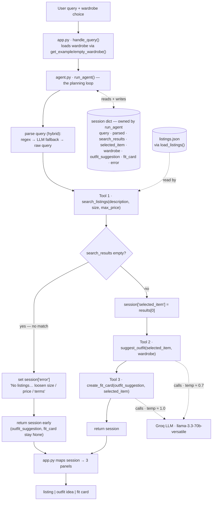

# FitFindr — planning.md

> Complete this document before writing any implementation code.
> Your spec and agent diagram are what you'll use to direct AI tools (Claude, Copilot, etc.) to generate your implementation — the more specific they are, the more useful the generated code will be.
> Your planning.md will be reviewed as part of your submission.
> Update it before starting any stretch features.

---

## Tools

List every tool your agent will use. For each tool, fill in all four fields.
You must have at least 3 tools. The three required tools are listed — add any additional tools below them.

### Tool 1: search_listings

**Exact signature:** `search_listings(description: str, size: str | None = None, max_price: float | None = None) -> list[dict]`

**What it does:**
Searches the 40-item mock listings dataset (`load_listings()`) for pieces matching a
free-text `description`, optionally narrowed by `size` and a price ceiling, and returns
the survivors ranked by keyword relevance. This is the only tool that touches the
dataset; the other two work on whatever item it surfaces.

**Input parameters:**
- `description` (str): free-text keywords describing the wanted piece, e.g.
  `"vintage graphic tee"`. Required. Drives the relevance ranking.
- `size` (str | None): a single size token to filter by, e.g. `"M"`, `"L"`, `"8"`.
  `None` (default) skips size filtering.
- `max_price` (float | None): inclusive upper price bound in dollars, e.g. `30.0`.
  `None` (default) skips price filtering.

**Matching logic (so this is implementation-ready):**
1. `load_listings()` to get all 40 dicts.
2. **Price filter:** if `max_price` is set, keep listings with `price <= max_price`
   (inclusive).
3. **Size filter (token match):** if `size` is set, lowercase the listing's `size`,
   split it on slashes and spaces, and keep the listing only if the requested size
   equals one of those tokens. So `"M"` matches `"S/M"`, `"M/L"`, `"M (oversized)"`,
   but **not** `"XL"` or `"US 8"`.
4. **Relevance score:** lowercase `description`, remove a small stop-list of filler
   words (`a, an, the, for, in, with, looking, want, need`), split into keywords.
   Build a searchable blob per listing from `title + description + style_tags +
   category + colors + brand`. Score = the number of distinct keywords that appear
   as a substring in that blob.
5. **Drop** any listing scoring `0`, sort the rest by score (highest first),
   break ties by lower `price`.

**What it returns:**
A `list[dict]` of full listing dicts, best match first. Each dict has all 11 dataset
fields: `id, title, description, category, style_tags (list), size, condition,
price (float), colors (list), brand, platform`. The planning loop uses `results[0]`
as the selected item. Returns `[]` when nothing survives the filters/scoring.

**What happens if it fails or returns nothing:**
Returns an empty list `[]` — it **never raises**. The planning loop detects the empty
list, writes a helpful message into `session["error"]`, and stops before calling the
later tools (it never passes empty input to `suggest_outfit`).

---

### Tool 2: suggest_outfit

**Exact signature:** `suggest_outfit(new_item: dict, wardrobe: dict) -> str`

**What it does:**
Calls the Groq LLM (`llama-3.3-70b-versatile`) to style one thrifted item against the
user's wardrobe, returning one or two complete outfit combinations that name real
pieces the user already owns.

**Input parameters:**
- `new_item` (dict): a single listing dict (normally `search_results[0]`) — the item
  the user is considering. Supplies title, category, colors, style_tags to the prompt.
- `wardrobe` (dict): a wardrobe dict with an `"items"` key holding a list of
  wardrobe-item dicts (`id, name, category, colors, style_tags, notes`). May be empty
  (`{"items": []}` from `get_empty_wardrobe()`).

**What it returns:**
A non-empty `str`. With a populated wardrobe: 1–2 specific outfits that pair `new_item`
with named wardrobe pieces (e.g. "with your baggy dark-wash jeans (w_001) and chunky
white sneakers (w_007)…"). With an empty wardrobe: general styling advice for the item
(what silhouettes, colors, and vibe it pairs with) instead of named pieces.
Temperature ≈ **0.7** — coherent, lightly varied.

**What happens if it fails or returns nothing:**
- Empty wardrobe (`wardrobe["items"] == []`) is handled explicitly: return the
  general-advice string, never an empty string and never a crash.
- If the LLM/network call raises, it is caught and a short graceful fallback string is
  returned instead of propagating the exception (honors "no crash / no silent fail").

---

### Tool 3: create_fit_card

**Exact signature:** `create_fit_card(outfit: str, new_item: dict) -> str`

**What it does:**
Calls the Groq LLM at a **higher temperature** to turn an outfit suggestion into a
short, casual, shareable caption — the kind of thing you'd put under an OOTD post —
mentioning the item name, price, and platform once each.

**Input parameters:**
- `outfit` (str): the outfit-suggestion text returned by `suggest_outfit()`.
- `new_item` (dict): the same listing dict, used for the item's `title`, `price`,
  and `platform` so the caption can name them naturally.

**What it returns:**
A 2–4 sentence `str` usable as an Instagram/TikTok caption. It reads casually (not like
a product description) and **varies for different inputs** — both because the content is
item/outfit-dependent and because the temperature is high (≈ **1.0**).

**What happens if it fails or returns nothing:**
If `outfit` is empty or whitespace-only, it returns a descriptive **error string**
(e.g. *"⚠️ No outfit to write up yet — run a search that finds an item first."*) rather
than raising. On the happy path this guard is never hit, because the planning loop only
reaches this tool after a successful search produced an outfit.

---

### Additional Tools (if any)

None for the core build. Stretch candidates (a `compare_price` fourth tool, or
retry-with-loosened-constraints fallback in the loop) will be designed **here first**
and this document updated before any stretch code is written.

---

## Planning Loop

**How does your agent decide which tool to call next?**

`run_agent(query, wardrobe)` runs a single linear-with-a-branch loop over the session
dict. The branch on the `search_listings` result is what makes it conditional rather
than a fixed call-all-three sequence:

1. `session = _new_session(query, wardrobe)`.
2. **Parse the query (hybrid).** Run a regex parser that pulls `max_price` from
   patterns like `under $30` / `$30` / `30$` / `30 dollars` / `30 bucks`, pulls `size`
   from `size M` / `in M` / `size 8` **and word sizes** (`Medium`→`M`, `Large`→`L`,
   `x-large`→`XL`, normalized to a canonical label), and treats the leftover words as
   `description`. The regex deliberately covers these phrasing variants itself so the
   common cases stay deterministic and need no network call.
   - **Fallback A (LLM net):** if the regex still leaves `description` empty/whitespace,
     ask the LLM to parse the raw query into `{description, size, max_price}` — the
     safety net for phrasings the regex can't recognize.
   - **Fallback B:** if that LLM call fails or returns unparseable output, use the raw
     query string as `description` (keeping any `size`/`max_price` the regex did find).
   Store the result in `session["parsed"]`. This chain guarantees `search_listings`
   always receives a usable `description`.
3. **Search.** Call `search_listings(description, size, max_price)` and store the list
   in `session["search_results"]`.
4. **Branch (the conditional step):**
   - **If `search_results == []`** → set `session["error"]` to a specific, actionable
     message and **`return session` early**. `selected_item`, `outfit_suggestion`, and
     `fit_card` stay `None`; `suggest_outfit` is **never** called with empty input.
   - **Else** → set `session["selected_item"] = search_results[0]` and continue.
5. **Suggest.** Call `suggest_outfit(selected_item, wardrobe)`; store the string in
   `session["outfit_suggestion"]`.
6. **Fit card.** Call `create_fit_card(outfit_suggestion, selected_item)`; store the
   string in `session["fit_card"]`.
7. **Done.** `return session`. The loop knows it is finished when either the error
   branch returns early or `fit_card` has been written.

---

## State Management

**How does information from one tool get passed to the next?**

A single **session dict** (built by `_new_session`) is the one source of truth for the
whole interaction — there are no globals and the user never re-enters anything between
steps. **`run_agent` owns the dict:** it reads the fields written by earlier steps and
passes them as arguments to each tool, then writes each tool's return value back into a
single field. The tools themselves are pure functions — they receive arguments and
return values, and never read or write the session directly.

| Field | Written by | Consumed by (passed as arg to / read by) |
|-------|-----------|------------------------------------------|
| `query` | `_new_session` (raw input) | `run_agent` parse step |
| `parsed` | `run_agent` parse step (`{description, size, max_price}`) | `run_agent` → args to `search_listings` |
| `search_results` | `run_agent` (from `search_listings`) | `run_agent` branch (selects `results[0]`) |
| `selected_item` | `run_agent` = `results[0]` after a non-empty search | `run_agent` → arg to `suggest_outfit` & `create_fit_card` |
| `wardrobe` | `_new_session` (passed in) | `run_agent` → arg to `suggest_outfit` |
| `outfit_suggestion` | `run_agent` (from `suggest_outfit`) | `run_agent` → arg to `create_fit_card` |
| `fit_card` | `run_agent` (from `create_fit_card`) | `app.py` output panel |
| `error` | `run_agent` branch, if search was empty | `app.py` output panel (short-circuits the rest) |

`app.py`'s `handle_query()` calls `run_agent()`, then reads the finished session dict:
if `error` is set it shows that message in the listing panel and leaves the other two
empty; otherwise it formats `selected_item` into the listing panel and passes
`outfit_suggestion` and `fit_card` to the other two panels.

---

## Error Handling

For each tool, describe the specific failure mode you're handling and what the agent does in response.

| Tool | Failure mode | Agent response |
|------|-------------|----------------|
| search_listings | No results match the query | Tool returns `[]` (no raise). The loop sets `session["error"]`, e.g. *"I couldn't find any listings matching 'designer ballgown' in size XXS under $5. Try removing the size filter, raising your budget, or using broader terms like 'dress'."*, and returns early without calling the later tools. |
| suggest_outfit | Wardrobe is empty | Detects `wardrobe["items"] == []` and returns **general** styling advice for the item (silhouettes, colors, vibe) instead of named pieces — a useful non-empty string, never a crash. (A network/LLM error is also caught and returns a graceful fallback string.) |
| create_fit_card | Outfit input is missing or incomplete | Detects empty/whitespace `outfit` and returns a descriptive error string (*"⚠️ No outfit to write up yet — run a search that finds an item first."*) instead of raising. |

### Failure-mode verification (Milestone 5)

All three documented failure modes were triggered directly against the tools and
captured in **`milestone5_tests.png`** (repo root):

1. **`search_listings` — no match.** `search_listings("designer ballgown", size="XXS",
   max_price=5)` returns `[]` (never raises), exactly as specified.
2. **`suggest_outfit` — empty wardrobe.** Called with `get_empty_wardrobe()` on a real
   item (the Y2K baby tee), it returns a useful general-styling string — silhouettes,
   complementary colors, and example outfits — instead of naming owned pieces. Never
   empty, never a crash.
3. **`create_fit_card` — empty outfit.** `create_fit_card("", item)` returns the
   descriptive error string *"⚠️ No outfit to write up yet — run a search that finds an
   item first."* instead of raising.

---

## Architecture

The error branch (`search_results empty?` → **yes**) terminates the flow early at
`ERR → return session`, so control never reaches `suggest_outfit` or `create_fit_card`.
The **session dict is owned by `run_agent`** — it reads and writes every field and hands
values to the tools as arguments; the tools never touch it. The only external store a
tool reads is `listings.json` (via `load_listings()` inside `search_listings`), and the
two generative tools call the Groq LLM.

---

## AI Tool Plan

**Milestone 3 — Individual tool implementations:**

I'll use **Claude Code** and implement one tool at a time, each prompted from its own
block in the **Tools** section above (signature, inputs, matching logic, return, failure
mode):

- *`search_listings`* — give Claude the Tool 1 block and ask it to implement the function
  in `tools.py` using `load_listings()` from `utils/data_loader.py` (no re-reading files).
  **Expect:** price filter → token size filter → keyword scoring → drop-0 → sort, returning
  `[]` on no match. **Verify before trusting:** read the code to confirm it filters by all
  three params and never raises; then `tests/test_tools.py` checks a hit returns a non-empty
  list, `"designer ballgown"/XXS/$5` returns `[]`, and every result respects `max_price`.
- *`suggest_outfit`* — give Claude the Tool 2 block. **Expect:** a Groq call via
  `_get_groq_client()` that branches on an empty wardrobe. **Verify:** a populated wardrobe
  names real pieces; `get_empty_wardrobe()` still returns a useful non-empty string.
- *`create_fit_card`* — give Claude the Tool 3 block. **Expect:** an empty-outfit guard
  returning an error string, plus a high-temperature Groq call. **Verify:** empty `outfit`
  returns the error string (no exception); calling it twice on the same input yields
  **different** captions (raise temperature if not). I'll run all three against ≥3 queries
  with `pytest tests/` before any wiring.

**Milestone 4 — Planning loop and state management:**

I'll use **Claude Code**, prompted with the **Planning Loop**, **State Management**, and
**Architecture** (Mermaid diagram) sections together:

- *`run_agent` in `agent.py`* — **Expect:** the hybrid parse, then the conditional branch
  on `search_results`, storing each value in the session dict. **Verify:** read it to confirm
  it branches on `[]` (not call-all-three) and sets `session["error"]` + returns early;
  then run `python agent.py` and confirm the happy path fills `selected_item →
  outfit_suggestion → fit_card`, while the no-results case leaves `fit_card == None`.
- *`handle_query` in `app.py`* — **Expect:** call `run_agent()` and map the session dict to
  the three panels, showing `error` alone when set. **Verify:** launch `python app.py` and
  confirm state flows end-to-end and the no-results error shows only in the listing panel.

---

## A Complete Interaction (Step by Step)

**What FitFindr does (in three sentences):** FitFindr takes one natural-language
thrifting request and orchestrates three tools to answer it. The query triggers
`search_listings` (filter by description / size / price); the top match triggers
`suggest_outfit` (style it against the user's wardrobe); that styling triggers
`create_fit_card` (write a shareable caption). If `search_listings` finds nothing the
agent stops and tells the user what to adjust instead of calling the later tools with
empty input; an empty wardrobe makes `suggest_outfit` give general advice; missing
outfit text makes `create_fit_card` return an error string.

**Example user query:** "I'm looking for a vintage graphic tee under $30, size M. I mostly wear baggy jeans and chunky sneakers. What's out there and how would I style it?"

**Step 1 — Search.** `search_listings("vintage graphic tee", size="M", max_price=30.0)`.
Size matching is token-based, so `"M"` qualifies `"S/M"`. The results come back ranked
by keyword overlap, and the **top match is lst_002 — "Y2K Baby Tee — Butterfly Print"**
($18, Depop), which hits all three keywords (`vintage`, `graphic`, `tee`). The agent
stores the list and sets `selected_item = results[0]`.

**Step 2 — Suggest outfit.** `suggest_outfit(lst_002, wardrobe)`. The wardrobe holds the
user's baggy jeans (w_001) and chunky sneakers (w_007), so the LLM returns a specific
outfit (fitted tee + baggy jeans + chunky sneakers). Stored in `outfit_suggestion`.

**Step 3 — Fit card.** `create_fit_card(suggestion, lst_002)`. With a higher temperature
the LLM returns a casual, shareable caption naming the item, its $18 price, and Depop.
Stored in `fit_card`.

**Final output to user:** Three Gradio panels — the listing, the outfit, the fit card —
from one query, with no re-entry between steps.

**Error path:** An impossible query ("designer ballgown, size XXS, under $5") makes
`search_listings` return `[]`; the agent sets `session["error"]` and returns early,
leaving `outfit_suggestion` and `fit_card` as `None` — `suggest_outfit` is never called
with empty input.
